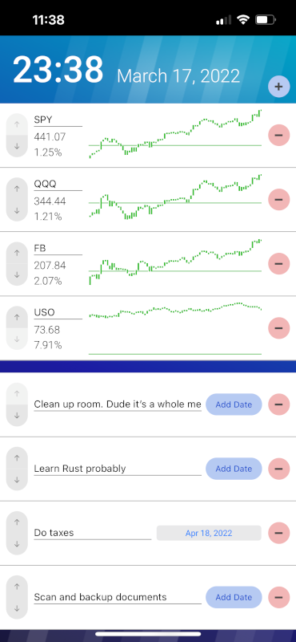

# initialxy-dashboard

This is my personal Raspberry Pi project, which uses an always-on e-ink screen as a dashboard. It shows three secions: date and time, stocks and tasks. It's optimized specifically for the Waveshare 7.5" monochrome 800x480px e-ink screen that I purchased. So it's probably not useful elsewhare.

# Prerequisites
* Python 3.13+
* npm 6.14.8+
* node 14.9.0+
* On 64-bit Raspberry Pi OS, you need to get the [latest ChromeDriver from electron](https://github.com/electron/electron/releases) and put it under `/home/pi/bin` with executable permission.

# Build and run
I used [venv](https://docs.python.org/3/library/venv.html) to create a virtual env first, though that's optional.

    python3 -v  # 3.13 and above
    python3 -m venv venv #  You can choose a different name
    source venv/bin/activate
    pip install -r requirements.txt
    cd frontend
    npm install
    cd ..
    ./build

To run this app in dev mode

    ./run --debug

Use `--help` to see the other dev mode options. Then open a second terminal instance and run

    cd frontend
    npm run serve

Go to http://localhost:8000 in your browser.

To run this app in prod mode without sourcing venv

    ./run

Alternatively, if you opt not to use venv

    python3 api.py

Note that you need to choose a port that does not require `sudo` (> 1024), because selenium does not work under root. You can load the dashboard app on a web browser of our choice. Tap its right top corner to toggle edit mode. You can alternatively save it as a [PWA app](https://web.dev/progressive-web-apps/) on your home screen.

# Configure
Open `appconfig.json` and you can set a number of configurations. Hopefully it is self-explanatory.

# License
MIT